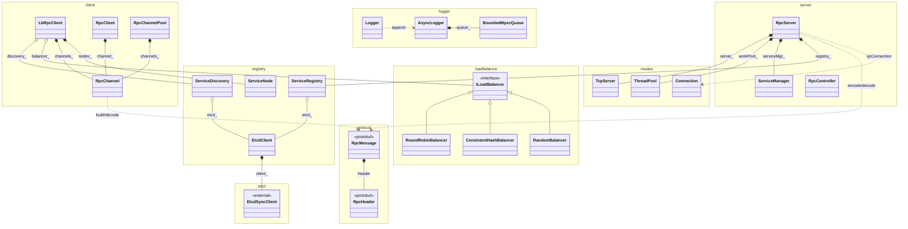
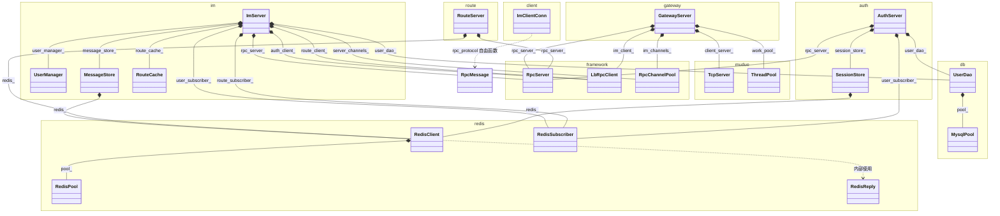
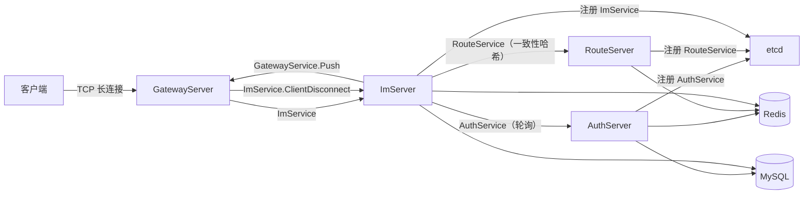

# MyRPC 对象框架图（类图）

本文档用 Mermaid 类图描述 MyRPC 的类/对象结构及其关系，分为三部分：

1. **核心框架**（`src/`）：client / server / protocol / registry / loadbalance / logger
2. **IM 应用**（`apps/im/`）：services(auth / route / im / gateway) / common(redis / db) / proto / client
3. **服务调用拓扑**：四个进程之间的 RPC 调用与依赖

## 关系符号约定

| 符号 | 含义 | 代码对应 |
|---|---|---|
| `*--` | 组合（拥有，值 / `unique_ptr` 成员） | `RpcServer *-- TcpServer` |
| `o--` | 聚合（`shared_ptr` / `weak_ptr` 持有） | `LbRpcClient o-- ServiceDiscovery` |
| `..>` | 依赖 / 调用（函数调用、`std::function` 回调） | `RpcChannel ..> RpcMessage` |
| `<\|--` | 继承 / 实现 | `ILoadBalancer <\|-- RoundRobinBalancer` |

箭头菱形端指向**拥有者/基类**，另一端指向**被拥有者/子类**。

> 关键点：IM 应用的各个 Server **全部通过组合（by-value 持有 `RpcServer`、`LbRpcClient`、`RpcChannelPool`）复用框架**，没有任何类继承自框架。RPC「服务」是注册进 `ServiceManager` 的字符串键（`"ServiceName/MethodName"`），不是 protobuf `service` 生成的桩类。

---

## 1. 核心框架（`src/`）

说明：

- **客户端不经过 muduo**：`RpcChannel` 是手写的同步 TCP 客户端（原始 POSIX socket + `poll`），仅复用 `rpc_protocol.h` 里的 `buildRequest` / `encodeMessage` / `decodeMessage` 自由函数。
- **服务端走 muduo**：`RpcServer` 持有 `TcpServer`（多 Reactor）+ `ThreadPool`（工作线程），在 `ServiceManager` 里按 `"service/method"` 字符串查 handler 后丢进 `workPool_` 执行。
- `LbRpcClient` 通过 `ServiceDiscovery` 从 etcd 拉节点、用 `ILoadBalancer` 选节点、用 `RpcChannel` 建连并 failover。
- 服务注册/发现都依赖 `EtcdClient`（封装外部 `etcd::SyncClient`）。

---

## 2. IM 应用（`apps/im/`）

说明：

- 每个进程都是一个「**组合根**」：`RpcServer` 对外提供 RPC 服务，`LbRpcClient`/`RpcChannelPool` 负责调用其它服务，`RedisClient`/`UserDao` 负责持久化。
- `ImServer` 是业务核心：`route_client_`（一致性哈希）调 Route、`auth_client_`（轮询）调 Auth、`server_channels_` 直接连 Gateway 推消息。
- `GatewayServer` 同时持有 muduo `TcpServer`（客户端长连接）和 `RpcServer`（接收 IM 回推），其嵌套 `ConnState` 用 `weak_ptr<Connection>` 记录每条连接被固定到的 IM 节点。
- `ImClientConn` 是测试客户端，不继承任何东西，仅复用 `rpc_protocol.h` 的自由函数收发帧。

---

## 3. 服务调用拓扑

说明：

- `AuthServer` / `RouteServer` / `ImServer` 启动时向 etcd 注册自身；`GatewayServer` **不注册 etcd**，IM 节点通过路由表里存的 `ip:port` 直接 `RpcChannel` 调用 `GatewayService.Push`。
- `ImServer` 与 `GatewayServer` 之间是**双向** RPC：Gateway 转发客户端消息到 IM，IM 回推消息到 Gateway。

## 服务注册与方法总览

| 进程 | etcd 服务名 | 提供的方法（字符串） | 调用的服务 |
|---|---|---|---|
| `AuthServer` | `AuthService` | Login, Register, VerifyToken, Refresh, Logout, IssueTicket, ResolveTicket, ListSessions, KickSession, KickAllSessions | —（Redis pub/sub `im:user:events`） |
| `RouteServer` | `RouteService` | RouteRegister, RouteQuery, RouteUnregister | —（Redis pub/sub `im:route:events`） |
| `ImServer` | `ImService` | Login, SendMessage, GetFriendList, AckMessage, PullOfflineMessages, Register, AddFriend, ChangePassword, Connect, IssueTicket, Refresh, Logout, ClientDisconnect | RouteService、AuthService、GatewayService.Push |
| `GatewayServer` | （无） | Push | ImService |

## 关键文件索引

- 框架客户端：`src/client/{lb_rpc_client,rpc_channel,rpc_channel_pool,rpc_client}.h`
- 框架服务端：`src/server/{rpc_server,service_manager,rpc_controller}.h`
- 协议：`src/protocol/{rpc_header.proto,rpc_protocol.h}`
- 负载均衡：`src/loadbalance/load_balancer.h`
- 注册中心：`src/registry/{service_discovery,service_registry,etcd_client}.h`
- 日志：`src/logger/{Logger,AsyncLogger,MpscQueue}.h`
- IM 各服务：`apps/im/services/{auth,route,im,gateway}/*.h`
- IM 共享库：`apps/im/common/{redis,db}/*.h`
- IM 测试客户端：`apps/im/client/*.h`
- muduo 网络库（fork）：`third_party/muduo/include/*.h`
